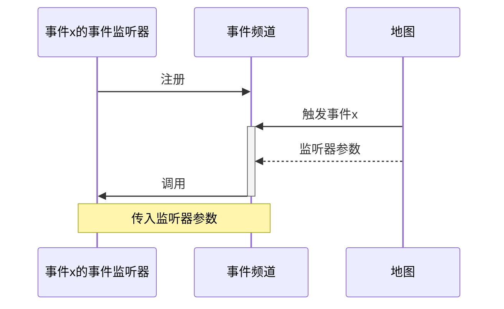
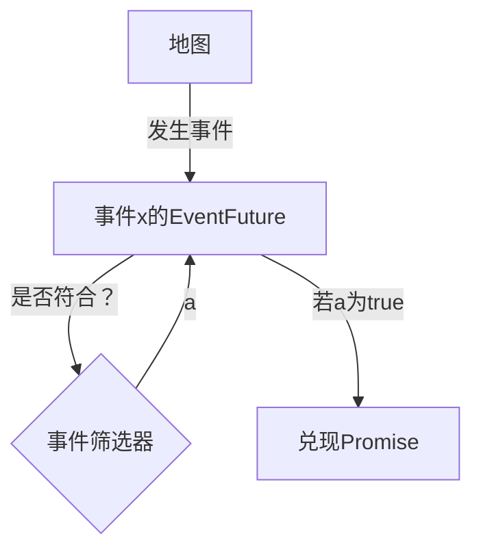

# <icon name='event'>事件</icon>

<icon name='event'>事件</icon>是Box3中监听地图变化的方式  
<icon name='event'>事件</icon>由以下组成：

- <icon name="function">事件处理器</icon>，包含 / 、 / ，用于监听地图的变化，在需要时运行事件监听器
- <icon name="callable">事件监听器</icon>，一种回调函数，通过<icon name="function">事件处理器</icon>触发，表示事件触发该干什么
- <icon name="class">监听器参数</icon>，通过<icon name="function">事件处理器</icon>传递给<icon name="callable">事件监听器</icon>，表示事件发生的具体细节

没看懂？下面用图表来表示Box3服务端中事件大致的处理逻辑

 / 

 / ：
