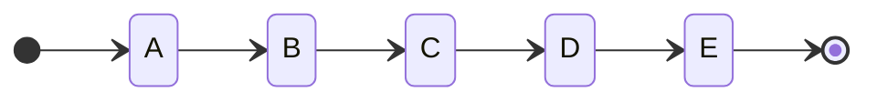
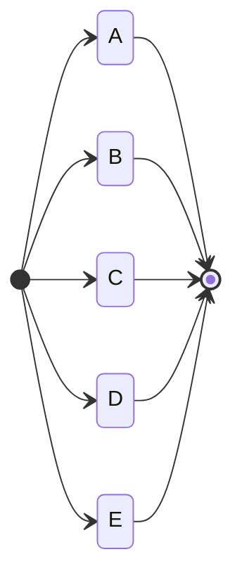

---
hide:
  - toc
---

<a href="https://github.com/qndm"></img></a>

## 前言
异步编程是Box3中非常重要的部分，涉及到对话框、数据库、HTTP、RTC等等内容，甚至包括最基础的等待。学习异步编程，可以让你更好的理解Box3的API，实现更多的效果

## 你对异步编程有多了解？
该文档不同内容适用于不同人群，根据自己的情况，点击下面链接跳转到该页面的不同地方  
<span class="hidden">你也许发现了，这个教程是没有目录的<br>这是编者特意设置的</span>

[异步编程？从没听说过](#1)  
[我听说过异步编程，但不知道怎么用](#2)  
[我只会用setTimeout setInterval](#3)  
[我会使用基本的async await，但不知道其中原理](#3)  
[我听说过Promise，但不知道和Box3有什么关系](#4)  
[我听说过Promise，但不会用（或者只会async await）](#5)  
[我听说过Promise，会使用then catch finally，但不会并发](#6)

## 1. 什么是异步编程？
我们先来讲下同步编程  
同步编程，就是所有事情同步执行（并不代表所有事情会在同一时刻完成，而是所有事情都在同一个线程进行）



异步编程和同步编程相对，事情可能不会在同一线程进行

我们来做个实验，定义一个等待1s的函数[sleep](function)，然后调用它
```javascript
async function sleep(){
    return new Promise((resolve) => {
        setTimeout(resolve, 1e3);
    });
}
(async () => {
    console.log(1);
    await sleep();
    console.log(2);
    await sleep();
    console.log(3);
    await sleep();
    console.log(4);
})();
```
此时输出结果应该是一秒输出一行，那是因为这是同步编程，程序等待[sleep](function)运行完之后才会继续
我们稍微修改一下调用：
```javascript
async function sleep(){
    return new Promise((resolve) => {
        setTimeout(resolve, 1e3);
    });
}
(async () => {
    console.log(1);
    sleep();
    console.log(2);
    sleep();
    console.log(3);
    sleep();
    console.log(4);
})();
```
你会发现所有输出都会瞬间完成，而这只是删掉了一个[await](keyword)（是不是很神奇），具体原因后文再说

---
第一部分完成啦(～￣▽￣)～，你已经知道什么是异步编程了接着看下一部分吧

## 2. 异步编程该如何使用
在Javascript中，异步编程主要有以下几种方法：

- [](setTimeout)
- [](setInterval)
- [](Promise)

[](setTimeout)用于设置一个定时器，一旦定时器到期，就会执行一个函数或指定的代码片段（具体使用请点击链接查看MDN）  
下面是一个简单示例：
```javascript
console.log(1);
setTimeout(() => {
    console.log(2);
}, 1000);
console.log(3);
```
输出结果应该是这样的：
```
1
3
2
```
其中，“2”是在“1”和“3”输出$1s$后才输出的  
可见，[](setTimeout)可以实现延期执行代码而不暂停后面代码的执行

让我们用[](setTimeout)制作一个倒计时：
```javascript
console.log('服务器崩溃');
console.log('倒数3');
setTimeout(() => {
    console.log('2');
    setTimeout(() => {
        console.log('1');
        setTimeout(() => {
            console.log('骗你的');
        }, 1000);
    }, 1000);
}, 1000);
```
很明显，这段<span class="hidden">又臭又长的屎山</span>代码显然是非常杂乱  
那有没有什么办法呢？有两种方法，一种是使用[](setInterval)，另一种是使用[](Promise)  
我们先将[](setInterval)。[](setInterval)用于重复调用一个函数或执行一个代码片段，在每次调用之间具有固定的时间间隔

!!! bug "内容未完成"

    该部分暂未完成

## 3. 什么是[](Promise)

!!! bug "内容未完成"

    该部分暂未完成

## 4. [](Promise)在Box3中的体现

!!! bug "内容未完成"

    该部分暂未完成

## 5. [](Promise)基本使用

!!! bug "内容未完成"

    该部分暂未完成

## 6. [](Promise)高级使用&并发

!!! bug "内容未完成"

    该部分暂未完成
