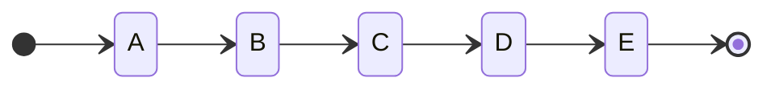
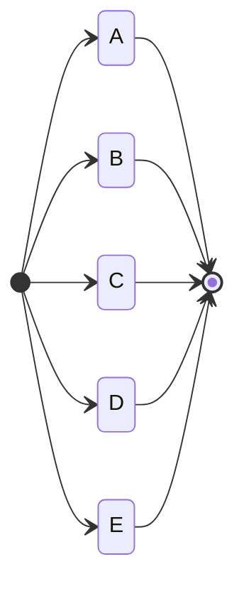
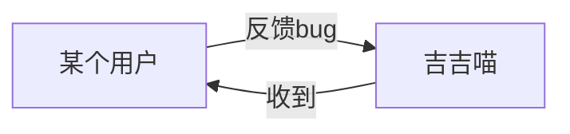
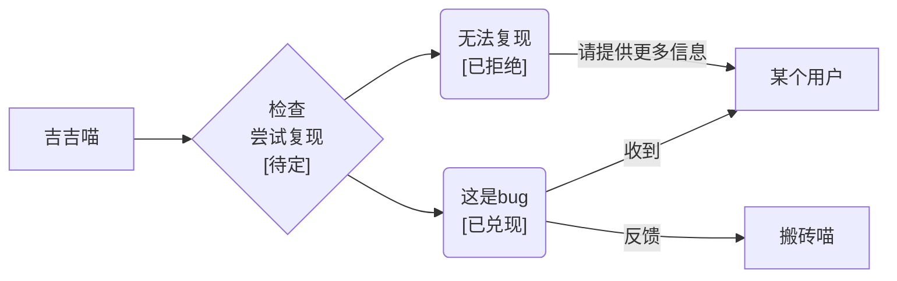
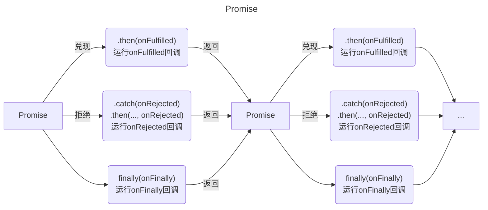

---
hide:
  - toc
---

<a href="https://github.com/qndm"></img></a>

## 前言
异步编程是Box3中非常重要的部分，涉及到对话框、数据库、HTTP、RTC等等内容，甚至包括最基础的等待。学习异步编程，可以让你更好的理解Box3的API，实现更多的效果

## 你对异步编程有多了解？
该文档不同内容适用于不同人群，根据自己的情况，点击下面链接跳转到该页面的不同地方  
<span class="hidden">你也许发现了，这个教程是没有目录的<br>这是编者特意设置的</span>

[我不会Javascript](#0-javascript)  
[我只会Hello world](#0-javascript)  
[在上一行的基础上，我只会定义变量和基础运算](#0-javascript)  
[在上一行的基础上，我只会if和else](#0-javascript)  
[在上一行的基础上，我只会for和while](#0-javascript)  
[在上一行的基础上，我只会switch](#0-javascript)  
[在上一行的基础上，我不会定义函数](#0)  
[在上上行的基础上，我只会定义函数](#1)  
[在上一行的基础上，我只会定义类](#1)  
[异步编程？从没听说过](#1)  
[我听说过异步编程，但不知道怎么用](#2)  
[我只会用setTimeout setInterval](#2)  
[我会使用基本的async await，但不知道其中原理](#3)  
[我听说过Promise，但不知道和Box3有什么关系](#4)  
[我听说过Promise，但不会用（或者只会async await）](#5)  
[我听说过Promise，但不会链式调用](#6)  
[我会Promise，想要了解关于Promise的更多信息](#7)

## 0. 先去学好Javascript吧
你可以不看这个页面了，去看看[Javascript 基础教程](../js/index.md)、[Javascript 教程 - 菜鸟教程](https://www.runoob.com/js/js-tutorial.html)和[Javascript 参考 - MDN](https://developer.mozilla.org/zh-CN/docs/Web/JavaScript/Reference)

## 1. 什么是异步编程？
我们先来讲下同步编程  
同步编程，就是所有事情同步执行（并不代表所有事情会在同一时刻完成，而是所有事情都在同一个线程进行）



异步编程和同步编程相对，事情可能不会在同一线程进行

我们来做个实验，定义一个等待$1s$的函数[sleep](function)，然后调用它
```javascript
function sleep(){
    return new Promise((resolve) => {
        setTimeout(resolve, 1e3);
    });
}
(async () => {
    console.log(1);
    await sleep();
    console.log(2);
    await sleep();
    console.log(3);
    await sleep();
    console.log(4);
})();
```
此时输出结果应该是一秒输出一行，那是因为这是同步编程，程序等待[sleep](function)运行完之后才会继续
我们稍微修改一下调用：
```javascript
function sleep(){
    return new Promise((resolve) => {
        setTimeout(resolve, 1e3);
    });
}
(async () => {
    console.log(1);
    sleep();
    console.log(2);
    sleep();
    console.log(3);
    sleep();
    console.log(4);
})();
```
你会发现所有输出都会瞬间完成，而这只是删掉了一个[await](keyword)（是不是很神奇），具体原因后文再说

---
第一部分完成啦(～￣▽￣)～，你已经知道什么是异步编程了接着看下一部分吧

## 2. 异步编程该如何使用
在Javascript中，异步编程主要有以下几种方法：

- [](setTimeout) / [](clearTimeout)
- [](setInterval) / [](clearInterval)
- [](Promise)

[](setTimeout)用于设置一个定时器，一旦定时器到期，就会执行一个函数或指定的代码片段（具体使用请点击链接查看MDN）  
计时器可以使用[](clearTimeout)清除
下面是一个简单示例：
<div class="grid" markdown>

```javascript title="Javascript"
console.log(1);
setTimeout(() => {
    console.log(2);
}, 1000);
console.log(3);
```

```title="输出结果"
1
3
2
```
</div>
其中，“2”是在“1”和“3”输出$1s$后才输出的  
可见，[](setTimeout)可以实现延期执行代码而不暂停后面代码的执行

让我们用[](setTimeout)制作一个倒计时：
```javascript
console.log('服务器崩溃');
console.log('倒数3');
setTimeout(() => {
    console.log('2');
    setTimeout(() => {
        console.log('1');
        setTimeout(() => {
            console.log('骗你的');
        }, 1000);
    }, 1000);
}, 1000);
```
很明显，这段<span class="hidden">又臭又长的屎山</span>代码显然是非常杂乱  
那有没有什么办法呢？有两种方法，一种是使用[](setInterval)，另一种是使用[](Promise)

我们先讲[](setInterval)。[](setInterval)会设定一个定时器，用于重复调用一个函数或执行一个代码片段，在每次调用之间具有固定的时间间隔  
[](clearInterval)用于清除[](setInterval)创建的定时器

!!! note "提示"
    [](clearInterval)和[](clearTimeout)技术上是可以互换使用的，但为了代码的易维护性，请匹配使用[](setInterval)、[](clearInterval)和[](setTimeout)、[](clearTimeout)

!!! question "思考"

    请使用[](setInterval)，而不使用[](setTimeout)和[](Promise)，实现上面计时器的效果  
    什么，你不会用？点击[](setInterval)和[](clearInterval)跳转到MDN查看详细说明

??? example "参考示例"

    ```javascript
    let lines = ['2', '1', '骗你的'], index = 0;
    console.log('服务器崩溃');
    console.log('倒数3');
    let intervalID = setInterval(() => {
        console.log(lines[index++]);
        if(index >= lines.length)
            clearInterval(intervalID);
    }, 1e3);
    ```
    我们来分析以下这段代码，[lines](variable)储存了计时器所有要输出的内容，[index](variable)储存了当前输出到第几行，[intervalID](variable)储存计时器的id  
    使用[](setInterval)每秒钟输出[lines](variable)[[index](variable)]，当输出完时，使用[](clearInterval)清除计时器

再来讲讲[](Promise)该怎么写  
（我知道你可能看不懂[](Promise)写法，那先不用管，后面会讲的）
=== "[await](keyword)写法"

    ```javascript
    function sleep(){
        return new Promise((resolve) => {
            setTimeout(resolve, ms);
        });
    }
    (async () => {
        console.log('服务器崩溃');
        console.log('倒数3');
        await sleep();
        console.log('2');
        await sleep();
        console.log('1');
        await sleep();
        console.log('骗你的');
    })();
    ```

=== "[](Promise)写法"

    ```javascript
    function sleep(){
        return new Promise((resolve) => {
            setTimeout(resolve, 1000);
        });
    }
    console.log('服务器崩溃');
    console.log('倒数3');
    sleep().then(() => {
        console.log('2');
        return sleep();
    }).then(() => {
        console.log('1');
        return sleep();
    }).then(() => {
        console.log('骗你的');
    });
    ```

这两段代码都可以在浏览器和Node.js中运行  
若在Box3环境中运行，则不需要定义[sleep](function)函数，因为Box3环境自带
=== "[await](keyword)写法"

    ```javascript
    (async () => {
        console.log('服务器崩溃');
        console.log('倒数3');
        await sleep(1000);
        console.log('2');
        await sleep(1000);
        console.log('1');
        await sleep(1000);
        console.log('骗你的');
    })();
    ```

=== "[](Promise)写法"

    ```javascript
    console.log('服务器崩溃');
    console.log('倒数3');
    sleep(1000).then(() => {
        console.log('2');
        return sleep(1000);
    }).then((1000) => {
        console.log('1');
        return sleep();
    }).then((1000) => {
        console.log('骗你的');
    });
    ```

Box3中，[sleep](function)用于等待特定的时间，单位为$ms$  
你也许发现了，[[await](keyword)写法]中[sleep](function)前面加了[await](keyword)，而[[](Promise)写法]中没有  
你可以试试在[[await](keyword)写法]中去除前面的[await](keyword)，而在[[](Promise)写法]中加上（注意空格），看看会发生什么  
先不急着讲具体原因，先把下一部分看了吧

## 3. 什么是[](Promise)

[](Promise)表示异步操作最终的完成（或失败）以及其结果值  
[](Promise)总处于以下三种状态之中：

- 待定（pending），初始状态，既没有被兑现，也没有被拒绝
- 已兑现（fulfilled），意味着操作成功完成
- 已拒绝（rejected），意味着操作失败

我们举个例子，某用户向吉吉喵反馈bug，吉吉喵收到后会回复该用户

但众所周知，吉吉喵是个很忙的喵，所以大多数情况下并不能做到秒回  
我们将吉吉喵回复的过程看作一个[](Promise)。吉吉喵没有回复的时候，这个[](Promise)就处于待定状态；若吉吉喵认为这确实是个bug，回复“收到”，这个[](Promise)就会兑现，处于已兑现状态；若吉吉喵认为还需要提供更多信息，或者这个bug无法复现，这个[](Promise)就会拒绝，处于已拒绝状态


## 4. [](Promise)在Box3中的体现
[](Promise)在Box3中用途很多，从最基本的[sleep](function)函数，再到[](Box3Player).[dialog](method) / [](GamePlayer).[dialog](method)方法，再到数据库[](Box3Database)和数据储存空间[](GameStorage)等等，都需要使用[](Promise)  
你是否发现，这些方法一般前面都要加[await](keyword)，而有的方法，例如[](Box3World).[say](method) / [](GameWorld).[say](method)则不用？  
我们来看看这些方法的声明

[](GameDataStorage).[get](method)([key](arg): [](string)): [](Promise)<[](ReturnValue)>  
[](GameDataStorage).[set](method)([key](arg): [](string), [value](arg): [](JSONValue)): [](Promise)<[](void)>

[](world).[say](method)([message](arg): [](string)): [](void)  
[](voxels).[setVoxel](method)([x](arg): [](number), [y](arg): [](number), [z](arg): [](number), [voxel](arg): [](number) | [](string), [rotation](arg): [](number) | [](string)): [](number)

可见，前两个方法的返回值是个[](Promise)，而后两个不是

## 5. [](Promise)基本使用

[](Promise)的构造函数需要填入一个回调函数，这个回调函数会立即开始执行  
[](Promise)会提供这个回调函数两个参数：[resolveFunc](callbackArg)和[rejectFunc](callbackArg)。若调用[resolveFunc](callbackArg)，这个[](Promise)就会兑现；若调用[rejectFunc](callbackArg)，这个[](Promise)就会拒绝；若这个回调函数发生错误，这个[](Promise)也会拒绝。这两个参数可以是任意的名称  
[resolveFunc](callbackArg)和[rejectFunc](callbackArg)都可以传入参数。[resolveFunc](callbackArg)的参数将会在兑现后作为[then](method)的回调函数参数[onFulfilled](callbackArg)的参数；[rejectFunc](callbackArg)的参数和这个回调函数发生的错误将会在兑现后作为[then](method)的回调函数参数[onRejected](callbackArg)和[catch](method)的回调函数参数[onRejected](callbackArg)的参数  
无论[](Promise)是已兑现还是已拒绝，最后都会调用[finally](method)的回调函数

我知道上面又臭又长的文档你已经看的头晕了，让我们来整理一下
:   [](Promise)的构造函数需要填入一个回调函数，这个回调函数会立即开始执行
    :   我们写一个简单的示例

        ```javascript
        new Promise((resolveFunc, rejectFunc) => {
            console.log('1');
            resolveFunc();
        });
        ```
        运行这段代码后，会 **立刻** 输出以下内容
        ```
        1
        ```

:   [](Promise)会提供这个回调函数两个参数：[resolveFunc](callbackArg)和[rejectFunc](callbackArg)。若调用[resolveFunc](callbackArg)，这个[](Promise)就会兑现；若调用[rejectFunc](callbackArg)，这个[](Promise)就会拒绝；若这个回调函数发生错误，这个[](Promise)也会拒绝。这两个参数可以是任意的名称
    :   我们也写一个简单的示例

        ```javascript
        new Promise((a, b) => {
            if(Math.random() >= 0.5)
                a();
            else if(Math.random() >= 0.5)
                b();
            else
                throw "抛出";
        }).then(() => {
            console.log('兑现');
        }, () => {
            console.log('拒绝');
        });
        ```
        运行这段代码后，应有$50\%$的几率输出`兑现`，$50\%$的几率输出`拒绝`

:   [resolveFunc](callbackArg)和[rejectFunc](callbackArg)都可以传入参数。[resolveFunc](callbackArg)的参数将会在兑现后作为[then](method)的回调函数参数[onFulfilled](callbackArg)的参数；[rejectFunc](callbackArg)的参数和这个回调函数发生的错误将会在兑现后作为[then](method)的回调函数参数[onRejected](callbackArg)和[catch](method)的回调函数参数[onRejected](callbackArg)的参数
    :   我们还是写一个简单的示例

        ```javascript
        new Promise((a, b) => {
            if(Math.random() >= 0.5)
                a('大于0.5');
            else if(Math.random() >= 0.5)
                b('拒绝');
            else
                throw "抛出";
        }).then((v) => {
            console.log('兑现', v);
        }, (reason) => {
            console.log('拒绝', reason);
        });
        ```
        运行这段代码后，应有$50\%$的几率输出`兑现 大于0.5`，$25\%$的几率输出`拒绝 拒绝`，$25\%$的几率输出`拒绝 抛出`

:   无论[](Promise)是已兑现还是已拒绝，最后都会调用[finally](method)的回调函数
    :   我们依然写一个简单的示例

        ```javascript
        new Promise((a, b) => {
            if(Math.random() >= 0.5)
                a('大于0.5');
            else if(Math.random() >= 0.5)
                b('拒绝');
            else
                throw "抛出";
        }).then((v) => {
            console.log('兑现', v);
        }).catch((reason) => {
            console.log('拒绝', reason);
        }).finally(() => {
            console.log('但无论无何，这是一个Promise')
        });
        ```
        运行这段代码后，应有$50\%$的几率输出`兑现 大于0.5`，$25\%$的几率输出`拒绝 拒绝`，$25\%$的几率输出`拒绝 抛出`  
        并且总是会输出`但无论无何，这是一个Promise`

这下你应该看懂了吧<span class="hidden">你要是还看不懂我也没办法了</span>  
我们用一张图来总结一下：



问题来了，我们刚刚所有的示例，都是自己写的[](Promise)，怎么在Box3中使用呢？  
我们以对话框为例：
```javascript
world.onPlayerJoin(({ entity }) => {
    var dialog = entity.player.dialog({
        type: 'select',
        title: '系统',
        content: `${entity.player.name}，你想看看box3-docs的更新日志吗`,
        options: ['让我看看！', '下次一定']
    });
    dialog.then((result) => {
        if(result && result.index === 0) {
            entity.player.dialog({
                type: 'text',
                title: 'box3-docs 更新日志',
                content: "新增Box3World / GameWorld页面\n新增Box3Entity / GameEntity页面\n新增Box3Player / GamePlayer页面\n新增db & Box3Database页面",
                hasArrow: true
            }).then((resolve) => {
                entity.player.dialog({
                    type: 'text',
                    title: 'box3-docs 更新日志',
                    content: "新增Box3Vector3 / GameVector3页面\n新增Box3Bounds3 / GameBounds3页面\n新增Box3RGBColor / GameRGBColor页面\n新增Box3RGBAColor / GameRGBAColor页面",
                    hasArrow: false
                });
            });
        }
    });
});
```
<span class="hidden">~~你怎么知道我是复制的~~</span>  
我们来分析一下，当玩家进入地图时，玩家会打开一个选择对话框，[dialog](method)方法会返回一个[](Promise)  
我们调用其[then](method)方法。那问题来了，我们怎么知道对话框给我们的参数是什么呢？  
我们根据API参考可知，[dialog](method)使用选择对话框时，其返回值为[](Promise)<[](Box3DialogSelectResponse) / [](GameDialogSelectResponse) | [](null)> & [](Box3DialogCancelOption) / [](GameDialogCancelOption)  
“ & [](Box3DialogCancelOption) / [](GameDialogCancelOption)”可以先不管，可以发现，前面是[](Promise)<...>，这个“...”就是[then](method)方法的回调函数的参数，即代码中[result](variable)的类型，即[](Box3DialogSelectResponse) / [](GameDialogSelectResponse) | [](null)  
然后就是根据[result](variable)来决定是结束还是继续<span class="hidden">套娃</span>了

这时可能有人说了：我就打开个对话框？这么复杂？  
因为这是个<span class="hidden">屎山代码</span>，还有更简单的方法，即在Box3中广泛使用的[await](keyword)  
[await](keyword)会等待[](Promise)解析完成，并直接返回[](Promise)<...>中“...”的值。这个过程中，会暂停后面代码的运行  
那如果[](Promise)拒绝了呢？那么[await](keyword)就会抛出错误  
如果不是[](Promise)，那么[await](keyword)不会解析，直接返回输入的东西
那么上面的代码就可以改写成这样子：
```javascript
world.onPlayerJoin(async ({ entity }) => {
    var result = await entity.player.dialog({
        type: 'select',
        title: '系统',
        content: `${entity.player.name}，你想看看box3-docs的更新日志吗`,
        options: ['让我看看！', '下次一定']
    });
    if(result && result.index === 0) {
        await entity.player.dialog({
            type: 'text',
            title: 'box3-docs 更新日志',
            content: "新增Box3World / GameWorld页面\n新增Box3Entity / GameEntity页面\n新增Box3Player / GamePlayer页面\n新增db & Box3Database页面",
            hasArrow: true
        });
        await entity.player.dialog({
            type: 'text',
            title: 'box3-docs 更新日志',
            content: "新增Box3Vector3 / GameVector3页面\n新增Box3Bounds3 / GameBounds3页面\n新增Box3RGBColor / GameRGBColor页面\n新增Box3RGBAColor / GameRGBAColor页面",
            hasArrow: false
        });
    }
});
```
是不是熟悉多了？<span class="hidden">~~是的我又是复制的~~</span>  
其实还有个奇葩写法，就是这样：
```javascript
world.onPlayerJoin(async ({ entity }) => {
    var dialog = entity.player.dialog({     // 注意这里没有await
        type: 'select',
        title: '系统',
        content: `${entity.player.name}，你想看看box3-docs的更新日志吗`,
        options: ['让我看看！', '下次一定']
    });
    let result = await dialog;              // 注意这里
    if(result && result.index === 0) {
        await entity.player.dialog({
            type: 'text',
            title: 'box3-docs 更新日志',
            content: "新增Box3World / GameWorld页面\n新增Box3Entity / GameEntity页面\n新增Box3Player / GamePlayer页面\n新增db & Box3Database页面",
            hasArrow: true
        });
        await entity.player.dialog({
            type: 'text',
            title: 'box3-docs 更新日志',
            content: "新增Box3Vector3 / GameVector3页面\n新增Box3Bounds3 / GameBounds3页面\n新增Box3RGBColor / GameRGBColor页面\n新增Box3RGBAColor / GameRGBAColor页面",
            hasArrow: false
        });
    }
});
```
这么写也是完全可行的，没有任何问题  
但要注意一点：有[await](keyword)必有[async](keyword)（除非在模块顶层），不然就等着吃`SyntaxError`（语法错误）吧

!!! info "提示"

    [async](keyword)/[await](keyword)的目的在于简化使用基于[](Promise)的API时所需的语法。[async](keyword)/[await](keyword)的行为就好像搭配使用了[生成器](https://developer.mozilla.org/zh-CN/docs/Web/JavaScript/Guide/Iterators_and_generators)和[](Promise)

!!! note "冷知识"

    其实[await](keyword)可以解析一切有[then](method)的对象，例如[](Box3Animation) / [](GameAnimation)，甚至你自己随手写的含有[then](method)的对象  
    于是你也可以在[animate](method)方法前加上[await](keyword)，也是可以生效的

除使用[await](keyword)之外，还可以使用链式使用，见下文

## 6. [](Promise)链式使用
你也许在前面的图中看到了，[](Promise)的[then](method)、[catch](method)、[finally](method)三个方法都会返回[](Promise)，这就是链式调用的核心  
假设有一个变量[a](variable): [](Promise)，[a](variable).[then](method)()也是一个[](Promise)，[a](variable).[then](method)().[then](method)()也是一个[](Promise)，就这么无限循环<span class="hidden">套娃</span>下去  
若其中有一个[](Promise)拒绝/抛出错误，那么Javascript就会在这个[](Promise)链中找到第一个[catch](method)并传递错误信息  
每个[then](method)的回调函数参数的返回值为下一个[then](method)的回调函数参数
下面是一个示例：
<div class="grid" markdown>

```javascript title="Javascript"
new Promise((resolve) => {
    resolve(1);
}).then(v => v * 50000)
.then(v => v + 2419 * 3)
.then(v => v * 2)
.then(v => console.log(v))
.then(v => {
    throw "1919810";
})
.then(v => console.log(v))
.catch(reason => console.log(reason))
.catch(reason => console.log(reason));
```

```title="输出结果"
114514
1919810
```
</div>

## 7. 扩展信息
关于[](Promise)，可以[查阅MDN](https://developer.mozilla.org/zh-CN/docs/Web/JavaScript/Reference/Global_Objects/Promise)获取更多信息<span class="hidden">毕竟这只是个快速入门QAQ</span>