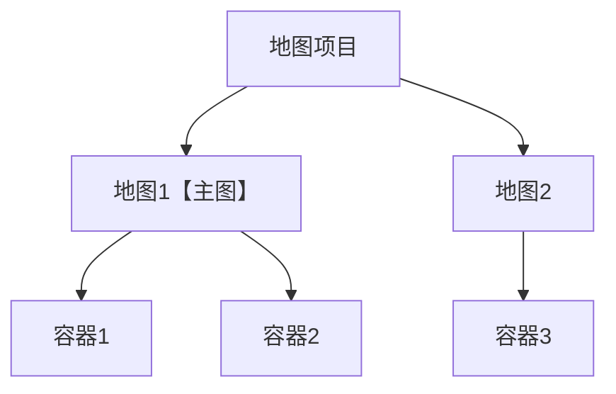

本页面用来解释各种术语

## 项目相关

### 地图/项目

一个地图项目。你在【创作】->【地图】页面中看到的就是你所有的地图项目

### 子地图
一个 **扩展** 地图项目中可能存在多个子地图，在【创作】->【地图】->【扩展地图】中可以看到每个地图项目中所有的子地图  
每个扩展地图项目的ID等于其主图的地图ID  
每个子地图都可以单独编辑，并使用<docs-def>world</docs-def>.<a href="/api/world/#teleport"><docs-icon icon="method" class="pro-only">teleport</docs-icon></a>方法在多个子地图中传送

### 容器/服务器
